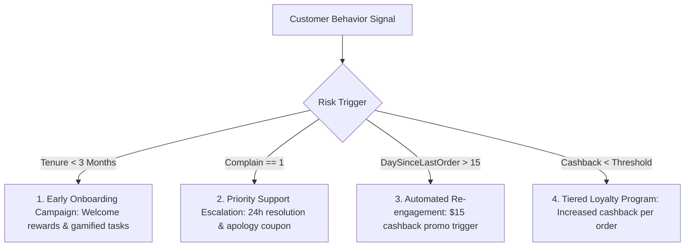

# 🔍 Comprehensive Exploratory Data Analysis (EDA) & Business Insights

This document summarizes the key exploratory data analysis findings, statistical patterns, and actionable business insights extracted from the e-commerce customer churn dataset.

---

## 🎯 1. Business Problem & Objectives

- **Business Need:** E-commerce companies face high customer acquisition costs (CAC). Retaining existing customers yields significantly higher lifetime value (LTV) and marketing ROI.
- **Objective:** Build a data-driven early warning system to identify at-risk customers (`Churn = 1`) before they leave, enabling targeted, cost-effective retention campaigns.
- **Target Variable:** `Churn` (Binary: `0` = Retained, `1` = Churned).

---

## 📊 2. Dataset Overview & Data Quality

- **Total Sample Size:** 5,630 customer records.
- **Feature Set:** 20 raw features (15 numerical attributes, 5 categorical attributes).
- **Data Completeness:** Missing values are minor (~4–5% across select columns), with no feature exceeding 10% missingness.
- **Class Imbalance Distribution:**
  - **Majority Class (`Churn = 0`):** 83.2% (4,682 customers)
  - **Minority Class (`Churn = 1`):** 16.8% (948 customers)
  
> ⚠️ **Key Implication:** Standard accuracy is a misleading metric for imbalanced data. Evaluation metrics must focus on **Precision, Recall, F1-Score, and ROC-AUC**. SMOTE oversampling is required during model training.

---

## 📈 3. Key Numerical Correlations with Churn

Linear correlation analysis (`df.corr()`) reveals the primary numerical drivers associated with customer churn:

| Feature Name | Pearson Correlation | Direction | Key Finding |
| :--- | :---: | :---: | :--- |
| **`Tenure`** | **-0.349** | Negative | **Strongest driver.** Longer-tenured customers rarely churn. |
| **`Complain`** | **+0.250** | Positive | Customers filing complaints have a dramatically higher churn rate. |
| **`DaySinceLastOrder`** | **-0.161** | Negative | Customer inactivity (> 15 days) correlates with higher churn risk. |
| **`CashbackAmount`** | **-0.154** | Negative | Higher cashback rewards correlate with higher customer retention. |
| **`NumberOfDeviceRegistered`** | **+0.108** | Positive | Multi-device registration slightly increases churn risk. |
| **`SatisfactionScore`** | **+0.105** | Positive | Weak positive signal (requires non-linear tree models). |

---

## 🔬 4. Visual Analysis & Categorical Insights

### Numerical Distributions (Boxplot Analysis)
- **Tenure:** Churned customers have a median tenure of less than 3 months, whereas retained customers have significantly longer tenures.
- **Engagement & Spend:** Retained customers show higher app usage hours, higher order counts, and consistently higher cashback accumulated.

### Categorical Feature Patterns
1. **Preferred Login Device:** Customers logging in via **Computer** exhibit slightly higher churn rates compared to those using **Mobile Phone / App**.
2. **Preferred Payment Mode:** **Cash on Delivery (COD)** and **E-Wallet** users show higher churn rates than **Debit / Credit Card** users.
3. **Gender:** Male customers show a slightly higher churn rate than female customers (~18% vs ~15%).

---

## 💼 5. Business Story & Retention Strategy

### 👤 High-Risk Customer Profile
Based on EDA, the highest-risk churn candidate is a **new customer (tenure < 3 months)** who has **low engagement**, **inactive for > 15 days**, and recently **filed a customer complaint**.

### 💡 Strategic Recommendations

1. **Early Onboarding Campaign (0–3 Months):**
   - *Insight:* Churn is concentrated in the first 90 days.
   - *Action:* Implement a structured 30-60-90 day welcome series with progressive discounts to build customer habituation.

2. **Priority Support Escalation (`Complain`):**
   - *Insight:* Ranging complaints are a primary churn precursor (`corr = +0.25`).
   - *Action:* Automatically flag tickets from customers with `Complain = 1` for fast-track support resolution and follow up with a proactive apology voucher.

3. **Inactivity Trigger Workflows (`DaySinceLastOrder > 15`):**
   - *Insight:* Customers inactive for > 15 days are at critical risk of lapsing.
   - *Action:* Trigger automated re-engagement emails / push notifications offering personalized recommendations and limited-time coupons.

4. **Threshold Tuning for High Recall:**
   - *Insight:* Missed churners (False Negatives) are far more expensive than false alarms (False Positives).
   - *Action:* Adjust decision threshold from default 0.5 to **0.4**, increasing Recall to capture maximum churners while maintaining low false-alarm costs.
